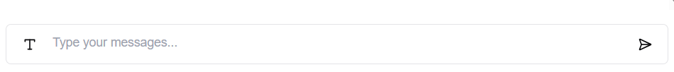
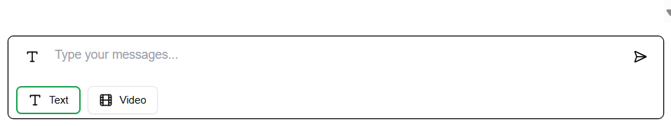
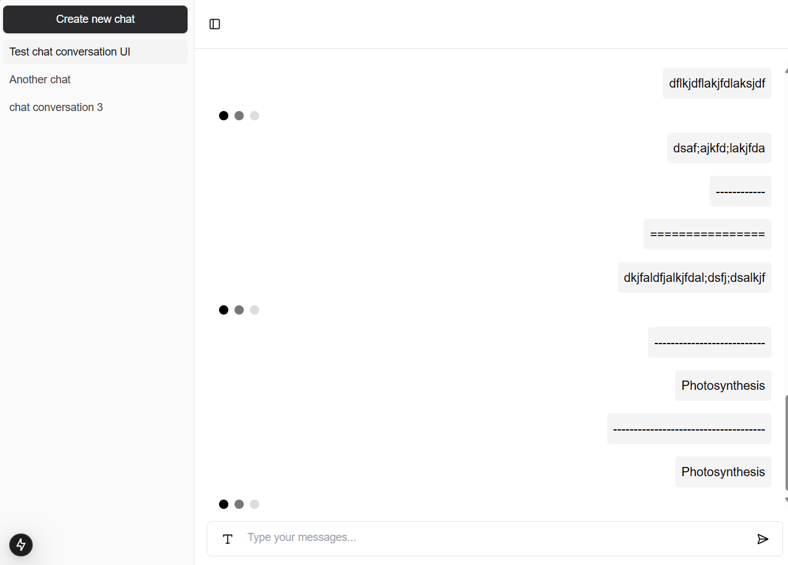

# Assignment - Minh Quan Le

## Chat bot helper for learner (video/image generator)

---

## Tech stack

### Generator API: [https://docs.vadoo.tv/docs/intro](https://docs.vadoo.tv/docs/intro)

### Frontend: NextJS, Shadcn/UI, tailwind

### Backend: Prisma, Postgres

### Other: Docker

---

### Run locally

#### Clone project

```bash
  git clone git@github.com:minhquanle312/chat-tutor.git
```

#### Go to project directory

```bash
  cd chat-tutor
```

#### Install dependencies (this project use Yarn berry)

```bash
  yarn
```

#### Generate @prisma/client to work with typescript

```bash
  npx prisma generate
```

#### Create `.env` file and copy this content below into its

```
VADOO_API_KEY=Y-qKrifYgkgebsjyPOfBxBFeOwOc2SmM5_yOk2WIMVo

DATABASE_USERNAME=chat-postgres
DATABASE_PASSWORD=1101
DATABASE_NAME=chat-bot
DATABASE_HOST=chat-db:5432

DATABASE_URL="postgresql://${DATABASE_USERNAME}:${DATABASE_PASSWORD}@${DATABASE_HOST}/${DATABASE_NAME}"
```

#### Start docker with dev profile

```bash
  docker compose --profile dev up --build --watch
```

#### Init database inside docker (only need to run in the first time) - this script create database and run all migrations file

```bash
  docker compose exec -it chat-tutor-dev npx prisma migrate deploy
```

#### Interact with database

```bash
  docker compose exec -it chat-tutor-dev npx prisma studio
```

### Restore backup file below if you want use sample data

### [Backup database local](public/db/chat-bot-backup-local.sql)

---

### Project work flow (inspired by chatGPT)

### Routing explanation

/: main page (redirect to '/c') - this page maybe container landing page, login/register

/c: create new chat - type your first message, it will create a chat and redirect to chat detail page

/c/[chatId]: chat detail - include all messages

### Workflow and behind the scenes

#### This app use SSR and full Server actions power by React





#### Click the `T` icon to expend message type selector

#### Text action:

- Type `text` only add a message to database now and have no response

#### Video action:

- Type `video` will add user message to database then send a request to generate video to [Vadoo create video](https://docs.vadoo.tv/docs/guide/create-an-ai-video)
- Vadoo will return new video id with this format `{ vid: string }`
- New message will create with sender is `bot`, type is `video` and videoId get from above response
- Page revalidate to update message list
- Video component will call [Vadoo get video URL](https://docs.vadoo.tv/docs/guide/get-video-url) first time
  - If response status is `in_progress` => interval call each 15 seconds (show typing animation)
  - If response status is `completed` => clearInterval and show video player

#### Chat UI demo


